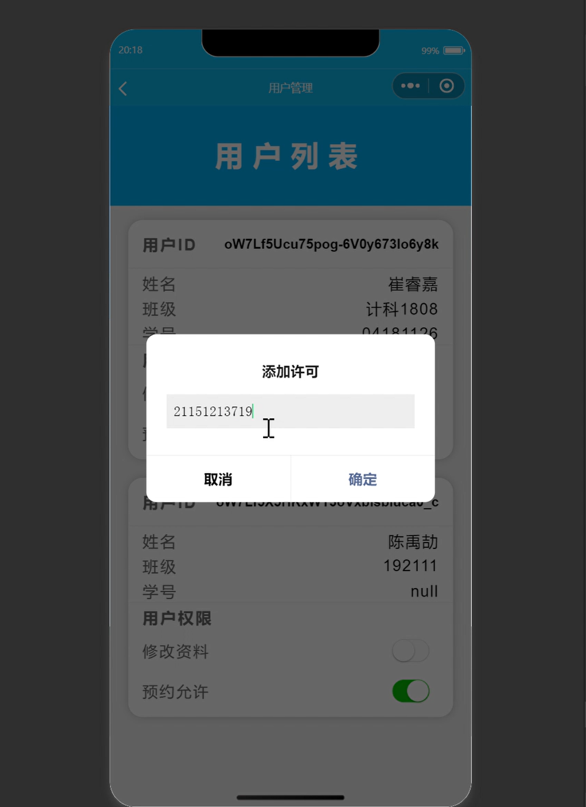

# 实验室预约系统
## 1. 项目说明
### 1.1 项目描述
本项目基于微信云开发完成的实验室预约系统，本项目实现了个人/班级两种预约模式，并实现学生管理员两种身份。

### 1.2 项目功能
1. 个人/班级两种基础预约模式，同一间实验室，个人预约后，还可以进行个人预约（另外的人），但是无法在这间实验室进行班级预约；当班级预约了某间实验室后，无论个人还是其余班级都无法进行预约（同实验室）
2. 学生/管理员两种身份，当新用户（学生）注册后需要先填写身份信息，随后管理员可以查看学生信息，并录入该学生学号，随后学生才可以进行实验室预约操作，否则学生无法进行实验室预约
3. 实验室活动公告，用户可以进行评论，点赞；评论可以根据默认排序（评论时间倒序），热度排序，最新排序（评论时间正序）三种排序方式
4. 实验室热度排序，实验室热度与实验室详情页的访问次数、预约次数以及评论数量有关
5. 学生预约实验室后，需要管理员进行审核，有关取消预约分为一下几中情况：（1）管理员尚未通过，此时学生可以自己取消预约；（2）管理员已通过，此时学生无法自行取消预约，需要通过管理员进行需要

### 1.2 注意事项
本项目是 2021 年完成的，当时微信云开始不需要按月付费，但是现在需要按月服务，没有交钱后微信把我的资源给删掉了...所以我现在也不记得用的哪些字段，字段名是什么...

## 2. 成果展示
这些是视频直接截图过来的可能有点不清晰，视频太大提交不了，很难受...
### 2.1 首页

### 2.2 预约界面

### 2.3 实验室热度排行

### 2.4 登录页面

### 2.5 活动页面

### 2.6 实验室检索

### 2.7 实验室详情

### 2.8 其他

